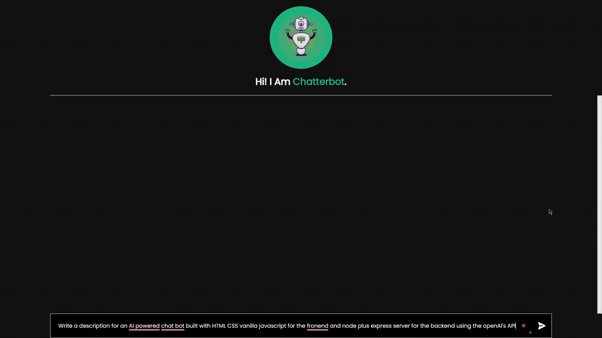

# ChatterBot - An AI Powered Chat Bot

An AI powered chat bot built with HTML, CSS, vanilla JavaScript for the frontend and a Node & Express server for the backend. It is powered by OpenAI's API, which provides a powerful set of tools to create intelligent conversations. The app is pretty simple but still very accurate.

> In fact, most of the above description has been written by the app itself.

## Live Preview

[ChatterBot - Live Demo](https://chatterbot-dk.netlify.app/)

[ChatterBot Server](https://chatterbot-dk.onrender.com)

## Key Components

- HTML, CSS, and Vanilla Javascript
- Node.js and Express.js
- DOM Manipulation
- OpenAI API
- HTTP Requests (GET and POST) and Response

## Preview

